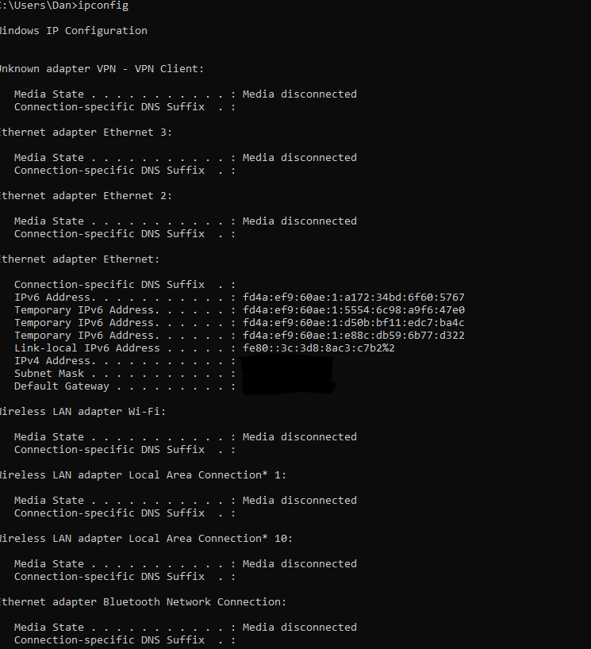
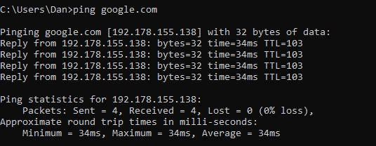
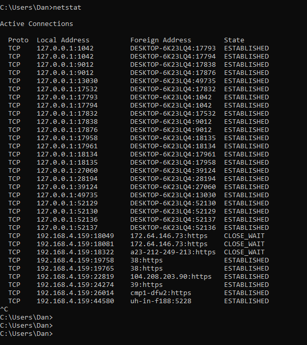

# IT Support & Networking Basics Lab

## Purpose
This project was created to build foundational IT support and networking troubleshooting skills using command-line tools.

## Overview
This project demonstrates basic network troubleshooting using command-line tools.

## Commands Used

### ipconfig
- Displays network configuration details such as IP address and default gateway.

### ping google.com
- Tests internet connectivity by sending packets to a remote server.

### netstat
- Shows active network connections and listening ports.

## What I Learned
- Basic networking concepts (IP address, connectivity)
- How to troubleshoot internet issues
- Understanding system network activity

## Note
Sensitive information such as IP addresses has been masked for security purposes.
